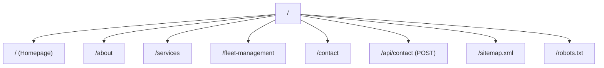

# Design Document: DAS Company Website

## Overview

The DAS (Dynamic Automotive Solutions) company website is a server-rendered Next.js 15 application using the App Router, styled with Tailwind CSS v4, animated with Framer Motion (with CSS animation fallbacks for performance), and deployed on Vercel. The site is a multi-page marketing website designed to convert visitors into leads through strategic CTAs, trust indicators, and a functional contact form.

The architecture prioritizes:
- **Mobile-first responsive design** with breakpoints at 768px (tablet) and 1024px (desktop)
- **Performance on low-end devices** via CSS animations, lazy loading, optimized images, and minimal JS bundles
- **SEO** via server-side rendering, structured data, and semantic HTML
- **Conversion optimization** via strategic CTA placement, trust indicators, and a sticky mobile CTA

## Architecture

### Tech Stack

| Layer | Technology |
|-------|-----------|
| Framework | Next.js 15 (App Router) |
| Runtime / Package Manager | Bun |
| Styling | Tailwind CSS v4 |
| Animations | CSS transitions/keyframes + Framer Motion (lazy-loaded for non-critical animations) |
| Deployment | Vercel |
| Form Handling | Next.js Server Actions |
| Image Optimization | Next.js `<Image>` component (WebP, responsive sizes) |
| SEO | Next.js Metadata API + JSON-LD |

### Application Structure

```
das-website/
├── public/
│   └── images/           # All DAS image assets copied from das-images/
├── src/
│   ├── app/
│   │   ├── layout.tsx        # Root layout (Navigation + Footer)
│   │   ├── page.tsx          # Homepage
│   │   ├── about/
│   │   │   └── page.tsx      # About page
│   │   ├── services/
│   │   │   └── page.tsx      # Services overview page
│   │   ├── fleet-management/
│   │   │   └── page.tsx      # Fleet Management page
│   │   ├── contact/
│   │   │   └── page.tsx      # Contact page
│   │   ├── api/
│   │   │   └── contact/
│   │   │       └── route.ts  # Contact form API endpoint
│   │   ├── sitemap.ts        # Dynamic sitemap generation
│   │   └── robots.ts         # Robots.txt generation
│   ├── components/
│   │   ├── layout/
│   │   │   ├── Header.tsx
│   │   │   ├── MobileDrawer.tsx
│   │   │   └── Footer.tsx
│   │   ├── home/
│   │   │   ├── HeroSection.tsx
│   │   │   ├── ServicesOverview.tsx
│   │   │   ├── WhyChooseDAS.tsx
│   │   │   ├── Testimonials.tsx
│   │   │   └── HomeCTA.tsx
│   │   ├── about/
│   │   │   ├── CompanyStory.tsx
│   │   │   └── TeamSection.tsx
│   │   ├── services/
│   │   │   ├── ServiceCard.tsx
│   │   │   └── ServiceDetail.tsx
│   │   ├── contact/
│   │   │   ├── ContactForm.tsx
│   │   │   ├── ContactInfo.tsx
│   │   │   └── MapEmbed.tsx
│   │   ├── shared/
│   │   │   ├── CTAButton.tsx
│   │   │   ├── StickyMobileCTA.tsx
│   │   │   ├── ScrollReveal.tsx
│   │   │   ├── SectionHeading.tsx
│   │   │   └── TrustIndicators.tsx
│   │   └── ui/
│   │       └── ImageWithFallback.tsx
│   ├── lib/
│   │   ├── constants.ts      # Site-wide constants, nav links, service data
│   │   ├── metadata.ts       # SEO metadata helpers
│   │   ├── schemas.ts        # JSON-LD schema generators
│   │   └── validation.ts     # Contact form validation
│   └── styles/
│       └── globals.css        # Tailwind directives + custom CSS animations
├── tailwind.config.ts
├── next.config.ts
├── package.json
└── tsconfig.json
```

### Routing



### Rendering Strategy

All pages use **Server-Side Rendering (SSR)** by default via Next.js App Router server components. Interactive components (mobile drawer, contact form, scroll animations) are client components loaded with `"use client"` directive. Non-critical interactive components use `next/dynamic` with `ssr: false` for code splitting.

## Components and Interfaces

### Layout Components

#### Header
- Renders DAS logo (from `das-images/DAS  PROFILE-2025-images-1.jpg`) and navigation links
- Fixed position with `position: sticky; top: 0`
- Desktop: horizontal nav links | Mobile (<768px): hamburger icon triggering MobileDrawer
- Background becomes opaque on scroll via CSS transition

#### MobileDrawer
- Client component with `"use client"`
- Slide-in drawer from right, animated with CSS `transform: translateX()`
- Renders nav links vertically with close button
- Traps focus within drawer when open (accessibility)
- Closes on backdrop click or Escape key

#### Footer
- Contact info: phone, email, address, operating hours
- Quick links mirroring main navigation
- Social media icon links
- DAS logo and copyright notice

### Homepage Components

#### HeroSection
- Full-width banner with background image (DAS service image)
- Headline: "75+ Years of Cumulative Automotive Expertise"
- Tagline and primary CTA button ("Get a Quote" / "Book Now")
- CSS gradient overlay for text readability

#### ServicesOverview
- Grid of ServiceCard components (2 columns mobile, 3 columns desktop)
- Each card: icon/image, service title, short description, link to services page

#### WhyChooseDAS
- 4-column grid of differentiators with icons
- Items: Expertise, Quality, Trust, Fleet Specialization

#### TrustIndicators
- Stat counters: "75+ Years Experience", "X Vehicles Serviced", certifications
- Animated count-up on scroll into view (CSS animation)

#### Testimonials
- Carousel or grid of client testimonials
- Each: quote text, client name, company (if applicable)

### Service Components

#### ServiceCard
```typescript
interface ServiceCardProps {
  title: string;
  description: string;
  image: string;
  href: string;
  icon?: React.ReactNode;
}
```

#### ServiceDetail
```typescript
interface ServiceDetailProps {
  id: string;
  title: string;
  description: string;
  features: string[];
  image: string;
  ctaText: string;
}
```

### Contact Components

#### ContactForm
```typescript
interface ContactFormData {
  name: string;
  email: string;
  phone: string;
  serviceInterest: string;
  message: string;
}

interface ContactFormState {
  status: 'idle' | 'submitting' | 'success' | 'error';
  errors: Partial<Record<keyof ContactFormData, string>>;
  message: string;
}
```

- Client component using React `useActionState` with Next.js Server Action
- Inline validation on blur and on submit
- Service interest dropdown populated from services list
- Success/error states with appropriate messaging
- Retains form data on error

#### ContactInfo
- Displays phone (click-to-call on mobile), email (click-to-email), address, hours
- Uses semantic HTML (`<address>`, `<a href="tel:">`, `<a href="mailto:">`)

#### MapEmbed
- Lazy-loaded iframe embedding Google Maps or similar
- Shows DAS physical location
- Loaded only when scrolled into view

### Shared Components

#### CTAButton
```typescript
interface CTAButtonProps {
  text: string;
  href?: string;
  onClick?: () => void;
  variant: 'primary' | 'secondary';
  size?: 'sm' | 'md' | 'lg';
}
```
- Primary variant: red/orange accent background, white text
- Secondary variant: outlined with accent border

#### StickyMobileCTA
- Fixed bottom bar on mobile (<768px) with "Contact Us" button
- Appears after scrolling past hero section
- Uses CSS `position: fixed; bottom: 0`
- Hidden on desktop

#### ScrollReveal
- Wrapper component using `IntersectionObserver` to trigger CSS animations
- Applies `opacity` and `translateY` transitions when element enters viewport
- Respects `prefers-reduced-motion` media query
- No JavaScript animation library needed for basic reveals

#### ImageWithFallback
```typescript
interface ImageWithFallbackProps {
  src: string;
  alt: string;
  fallbackSrc: string;
  width: number;
  height: number;
  className?: string;
}
```
- Wraps Next.js `<Image>` with error handling
- On load error, displays branded placeholder with DAS logo

## Data Models

### Service Data

```typescript
interface Service {
  id: string;
  title: string;
  shortDescription: string;
  fullDescription: string;
  features: string[];
  image: string;        // path to image in public/images/
  icon: string;         // icon identifier
}
```

Services defined as static data in `lib/constants.ts`:
- Mechanical Repairs
- Auto Electrical
- Diagnostics
- Air Conditioning
- Fleet Management
- Vehicle Servicing
- Brake Systems

### Team Member Data

```typescript
interface TeamMember {
  id: string;
  name: string;
  role: string;
  image: string;        // path to team photo in public/images/
  bio?: string;
}
```

### Navigation Data

```typescript
interface NavLink {
  label: string;
  href: string;
}

const NAV_LINKS: NavLink[] = [
  { label: 'Home', href: '/' },
  { label: 'About', href: '/about' },
  { label: 'Services', href: '/services' },
  { label: 'Fleet Management', href: '/fleet-management' },
  { label: 'Contact', href: '/contact' },
];
```

### Contact Form Validation Schema

```typescript
interface ValidationRule {
  required?: boolean;
  minLength?: number;
  maxLength?: number;
  pattern?: RegExp;
  message: string;
}

interface ValidationSchema {
  [field: string]: ValidationRule[];
}

const contactFormSchema: ValidationSchema = {
  name: [
    { required: true, message: 'Name is required' },
    { minLength: 2, message: 'Name must be at least 2 characters' },
  ],
  email: [
    { required: true, message: 'Email is required' },
    { pattern: /^[^\s@]+@[^\s@]+\.[^\s@]+$/, message: 'Please enter a valid email address' },
  ],
  phone: [
    { required: true, message: 'Phone number is required' },
    { pattern: /^[\d\s\-+()]{7,20}$/, message: 'Please enter a valid phone number' },
  ],
  serviceInterest: [
    { required: true, message: 'Please select a service' },
  ],
  message: [
    { required: true, message: 'Message is required' },
    { minLength: 10, message: 'Message must be at least 10 characters' },
    { maxLength: 2000, message: 'Message must be under 2000 characters' },
  ],
};
```

### SEO Metadata

```typescript
interface PageSEO {
  title: string;
  description: string;
  ogImage?: string;
  canonical: string;
}

interface LocalBusinessSchema {
  '@context': 'https://schema.org';
  '@type': 'AutoRepair';
  name: string;
  description: string;
  telephone: string;
  email: string;
  address: {
    '@type': 'PostalAddress';
    streetAddress: string;
    addressLocality: string;
    addressRegion: string;
    postalCode: string;
    addressCountry: string;
  };
  openingHours: string[];
  image: string;
  url: string;
}
```

### Image Asset Mapping

```typescript
const IMAGE_ASSETS: Record<string, string> = {
  logo: '/images/DAS  PROFILE-2025-images-1.jpg',
  heroBackground: '/images/DAS  PROFILE-2025-images-3.jpg',
  mechanicalRepairs: '/images/DAS  PROFILE-2025-images-5.jpg',
  autoElectrical: '/images/DAS  PROFILE-2025-images-6.jpg',
  diagnostics: '/images/DAS  PROFILE-2025-images-7.jpg',
  fleetManagement: '/images/DAS  PROFILE-2025-images-8.jpg',
  airConditioning: '/images/DAS  PROFILE-2025-images-9.jpg',
  brakes: '/images/DAS  PROFILE-2025-images-10.jpg',
  teamPhoto1: '/images/DAS  PROFILE-2025-images-11.jpg',
  teamPhoto2: '/images/DAS  PROFILE-2025-images-12.jpg',
  teamPhoto3: '/images/DAS  PROFILE-2025-images-13.jpg',
  aboutBanner: '/images/DAS  PROFILE-2025-images-4.jpg',
  servicesBanner: '/images/DAS  PROFILE-2025-images-14.jpg',
  contactBanner: '/images/DAS  PROFILE-2025-images-15.jpg',
  fleetBanner: '/images/DAS  PROFILE-2025-images-16.jpg',
  gallery1: '/images/DAS  PROFILE-2025-images-17.jpg',
  gallery2: '/images/DAS  PROFILE-2025-images-18.jpg',
  gallery3: '/images/DAS  PROFILE-2025-images-19.jpg',
  gallery4: '/images/DAS  PROFILE-2025-images-20.jpg',
};
```
